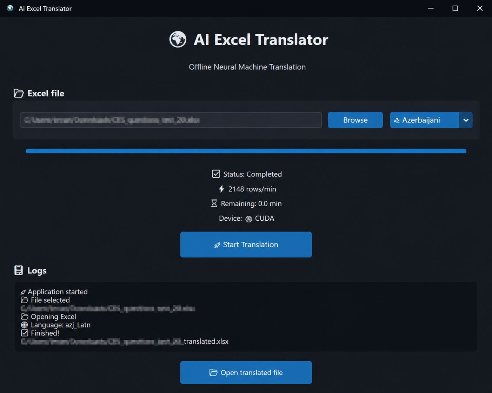

# 🌍 AI Excel Translator

Offline AI-powered Excel translator for **Excel (.xlsx)** files using **Meta NLLB-200**.



---

## ✨ Features

- 🌍 Translate Excel files to **Azerbaijani** and **Turkish**
- 🧠 Powered by **Meta NLLB-200**
- ⚡ GPU acceleration (CUDA)
- 💾 Translation Memory (separate for each language)
- 📊 Live progress bar
- ⚡ Translation speed
- ⏳ Remaining time estimation
- 🔄 Resume translation after interruption
- 📂 Open translated file directly from the application
- 💻 Modern CustomTkinter interface

---

## 📸 Screenshot


---

## 🚀 Installation

### 1. Clone the repository

```bash
git clone https://github.com/YOUR_USERNAME/AI-Excel-Translator.git
cd AI-Excel-Translator
```

### 2. Install dependencies

```bash
pip install -r requirements.txt
```

### 3. Run

```bash
python main.py
```

---

## 📦 Requirements

- Python 3.11+
- PyTorch
- Transformers
- OpenPyXL
- CustomTkinter

CUDA is optional but recommended for much faster translation.

---

## 🛠 Technologies

- Python
- Meta NLLB-200
- Hugging Face Transformers
- PyTorch
- OpenPyXL
- CustomTkinter

---

## 📂 Project Structure

```text
AI-Excel-Translator/

├── main.py
├── translator.py
├── excel_manager.py
├── progress.py
├── worker.py
├── config.py
├── requirements.txt
├── README.md
├── LICENSE
└── assets/
    └── screenshot.png
```

---

## 📈 Roadmap

- [x] Offline AI Translation
- [x] GPU (CUDA)
- [x] Translation Memory
- [x] Azerbaijani support
- [x] Turkish support
- [x] Resume translation
- [x] Translation speed
- [x] Remaining time
- [ ] Support for more languages
- [ ] Drag & Drop Excel files
- [ ] Export translation statistics

---

## 📄 License

This project is licensed under the MIT License.

---

## ⭐ If you like this project

Consider giving it a ⭐ on GitHub.